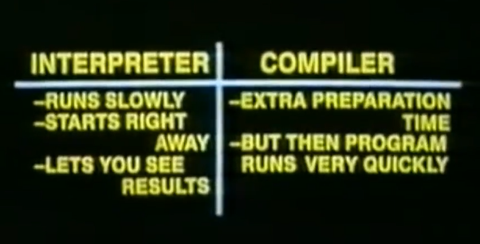

# 20.11.16과제

## 2, 4, 5, 6장 예습

### 2.자바스크립트란?
#### ES5와 ES6에서 추가된 부분
ES5의 경우 2009년에 출시되었으며, HTML5와 함께 표준안, JSON, strict mode, 접근자 프로퍼티, 프로퍼티 어트리뷰트 제어, 향상된 배열 조작 기능(forEach, map, filter, reduce, some, every)등이 추가되었다. 
##### Strict mode
`use strict`
이 구문을 문서의 자바스크립트 문서의 최상단에 위치시켜놓으면 자바스크립트 코드가 `strict mode`로 실행된다. 이 모드는 더 깔끔한 코드를 쓰도록 도와준다. 이 모드를 사용할 경우 silent error를 없앨 수 있다. 더 엄격하게 문법 체크를 해준다고 생각하면 좋을 듯하다.  
##### Sting.trim()
```javascript
var str = "       Hi       ";
console.log(str.trim());
```
만약 위처럼 쓰게 된다면 `str.trim()`에서 `trim()`메서드는 문자열의 앞과 뒤에 있는 빈공간을 모두 없애준다. 
##### Array.isArray()
()안에 들어간 object가 배열인지 아닌지 확인해서 true 아니면 false값을 return해준다. 
#####  Array.forEach()
```javascript
let txt = "";
let numbers = [45, 4, 7, 23, 2];
number.forEach(myFunction);

function myFunction(value) {
  txt = txt + value + "<br>";
}
```
배열에 있는 각 element에 대해서 특정한 함수를 사용한다.
#####  Array.map()
기존의 배열을 참고해서 다른 배열을 만들어낸다. 
세 개의 argument가 필요하다. 만약 callback함수가 value 파라미터만 사용할 경우 index와 array 파라미터는 무시할 수 있다. 
```js
let num_array = [1, 3, 5, 7];
let num_secondary = num_array.map(function(val){ 
  return val * 3;
});
``` 
위와 같이 많은 함수들이 추가 되었다 다음은 그 목록이다. 
- `Array.filter()`
- `Array.reduce()`
- `Array.every()`
- `Array.indexOf()`
- `Array.lastIndexOf`
- `JSON.parse()`
- `JSON.stringify()`
- `Date.now()`
- Property Getters and Setters
- `Object.defineProperty()`
- `charAt()`

ES6의 경우 2015년에 출시되었고 let/const, class, 화살표 함수, template literal, 디스트럭처링 할당, 스프레드 문법, rest 파라미터, 심벌, promise, Map/Set, Iterable, for...of, 제너레이터, Proxy, 모듈 import/export등이 추가 되었다. 


참고 사이트는 
- [speakingks.com](http://speakingjs.com/es5/ch25.html)
- [ES6 features](http://es6-features.org/#Constants)
#### 랜더링(rendering)

렌더링이란 HTML, CSS, 자바스크립트로 작성된 문서를 해석해서 **브라우저에 시각적으로 출력하는 것**을 말한다. 때로는 **서버에서 데이터를 HTML로 변환해서 브라우저에게 전달하는 과정(SSR; Server Side Rendering)**을 가리키기도 한다. 

그렇다면 브라우저는 어떻게 렌더링하는가?

#### Ajax
1999년, 자바스크립트를 이용해 서버와 브라우저가 비동기(asynchronous) 방식으로 데이터를 교환할 수 있는 통신 기능인 **Ajax(Asynchronous Javascript And XML)**가 XMLHttpRequest라는 이름으로 등장했다.

웹페이지 전체를 다시 load하지 않고 바뀌는 부분만 데이터를 가져와서 렌더링할 수 있게끔해준다. 

    Ajax (also AJAX /ˈeɪdʒæks/; short for "Asynchronous JavaScript and XML")[1][2] is a set of web development techniques using many web technologies on the client side to create asynchronous web applications. <-wikipedia->

#### jQuery
자주 사용하는 코드들을 재사용할 수 있는 형태로 가공해서 프로그래밍 효율을 높여주는 코드들을 라이브러리라고 한다면 jQuery란 엘리먼트를 선택하는 강력한 방법과 선택된 엘리먼트들을 효율적으로 제어할 수 있는 다양한 수단을 제공하는 자바스크립트 라이브러리를 말한다. 

간단한 jQuery문법
```js
$(function() {
    제이쿼리 코드;
});
```
#### JavaScipt engine
구글 맵스를 통해 웹 애플리케이션 프로그래밍 언어로서의 가능성이 확인된 자바스크립트로 웹 애플리케이션을 구축하려는 시도가 늘면서 더욱 빠르게 동작하는 자바스크립트 엔진의 필요성이 대두되었다. 2008년 등장한 구글의 V8 자바스크립트 엔진은 이러한 요구에 부합하는 빠른 성능을 보여주었다. **V8 자바스크립트 엔진**의 등장으로 자바스크립트는 데스크톱 애플리케이션과 유사한 사용자 경험(UX; user experience)을 제공할 수 있는 웹 애플리케이션 프로그래밍 언어로 정착하게 되었다.

**V8 자바스크립트 엔진으로 촉발된 자바스크립트의 발전으로 과거 웹 서버에서 수행되던 로직들이 대거 클라이언트(브라우저)로 이동했고, 이는 웹 애플리케이션 개발에서 프런트엔드 영역이 주목받는 계기로 작용했다.**

**자바스크립트 엔진의 종류**
- 크롬 V8
- Mozilla의 SpiderMonkey
- Edge의 Chakra
- Safari의 JSC
- 

#### Node.js
    Node.js는 Chrome V8 JavaScript 엔진으로 빌드된 JavaScript 런타임입니다. Node.js는 이벤트 기반, 논 블로킹I/O모델을 사용해 가볍고 효율적입니다. Node.js의 패키지 생태계인npm은 세계에서 가장 큰 오픈 소스 라이브러리 생태계이기도 합니다. -node.js 공식 사이트-
Node.js는 브라우저의 자바스크립트 엔진에서만 동작하던 자바스크립트를 브라우저 이외의 환경에서도 동작할 수 있도록 자바스크립트 엔진을 브라우저에서 독립시킨 **자바스크립트 실행 환경**이다. Node.js는 다양한 플랫폼에 적용할 수 있지만 서버 사이드 애플리케이션 개발에 주로 사용되며, 이에 필요한 모듈, 파일 시스템, HTTP 등 빌트인(built-in, 내장) API를 제공한다.

Node.js는 **비동기 I/O**를 지원하며 **단일 스레드(single thread) 이벤트 루프** 기반으로 동작함으로써 요청(request) 처리 성능이 좋다. 따라서 Node.js는 데이터를 실시간으로 처리하기 위해 I/O가 빈번하게 발생하는 SPA(Single Page Application)에 적합하다. 하지만 CPU 사용률이 높은 애플리케이션에는 권장하지 않는다.
#### SPA 프레임워크
SPA는 Single Page Application으로 한 페이지에 다 넣어놓는 것이다. 이러한 개발을 도와주도록 만들어진 프레임워크들을 말한다. 
#### JavaScript and ECMAScipt 
자바스크립트는 엄밀히 말해서 ECMASCript를 말하고 아무것도 추가 되지 않아서 Vanilla Script라고도 부른다. 
#### JavaScript 특징
자바스크립트는 인터프리터 방식이라고 나와있지만 자바스크립트 엔진이 자바스크립트를 빠르게 컴파일하고 실행할 수 있도록 그 안에 컴파일러와 인터프리터를 담고 있다. 이 부분에 대해서는 JavaScript엔진에 대해서 더 공부를 해봐야한다. 

그 대신 인터넷에 검색해보면 쉽게 찾을 수 있는 특징에 대해서 조사해본다. 
- **동기적 언어**
  이 부분에 있어서 설명하기 전에 그렇다면 여기서 말하는 동기, 비동기의 의미를 알고 나아가야한다. 
  `Asynchronous`란 요청을 보낸 후 응답과 관계없이 다음 동작을 실행하는 방식을 말한다. 
  `Synchronous`란 요청을 보낸 후 해당 요청의 응답을 받아야 다음 동작을 실행하는 방식을 말한다. 

  참고한 [웹페이지](https://velog.io/@jiwon/Javascript%EB%8A%94-%EB%8F%99%EA%B8%B0%EC%9D%BC%EA%B9%8C-%EB%B9%84%EB%8F%99%EA%B8%B0%EC%9D%BC%EA%B9%8C)에 따르면 자바스크립트는 동기적이고 `blocking`이며, `single-threaded`한 언어라고 한다. 하지만 이것은 오직 한 연산에서의 특성을 의미하고 모든 것에서의 특성을 의미하진 않는다. 

  사람들이 `JavaScript`가 비동기 언어라고 오해하는 이유는 JS가 비동기식으로 동작하도록 조작할 수 있기 때문이라고 한다. 
- 싱글스레드 기반
- 동적 타입 언어
- 함수가 일급 객체..
- 프로토타입 기반 객체 지향 언어

위의 특징들에 대해서는 더 조사해봐야한다. 

### 4. 변수란? 

#### Variables why do we need them?
변수의 정의 그리고 영어명은 variable로 **하나의 값을 저장하기 위해 확보한 메모리 공간 자체 또는 그 메모리 공간을 식별하기 위해 붙인 이름**을 말한다. 간단히 말하자면 변수는 프로그래밍 언어에서 **값을 저장하고 참조하는 메커니즘**으로, 값의 위치를 가리키는 상징적인 이름이다. 메모리 공간에 저장된 값을 식별할 수 있는 고유한 이름을 변수 이름이라 한다. 그리고 변수에 저장된 값을 변수 값이라고 한다.

변수에 값을 저장하는 것을 **할당(assignment. 대입, 저장)**이라 하고, 변수에 저장된 값을 읽어 들이는 것을 **참조(reference)**라 한다.

#### Indentifier
변수 이름을 식별자(identifier)라고도 한다. **식별자는 어떤 값을 구별해서 식별할 수 있는 고유한 이름을 말한다.** 사람을 이름으로 구별해서 식별하는 것처럼 값도 식별자로 구별해서 식별할 수 있다.
식별자는 값이 아니라 메모리 주소를 기억하고 있다. 식별자로 값을 구별해서 식별한다는 것은 식별자가 기억하고 있는 메모리 주소를 통해 메모리 공간에 저장된 값에 접근할 수 있다는 것을 의미한다. 즉, 식별자는 메모리 주소에 붙인 이름이라고 할 수 있다.

변수, 함수, 클래스 등의 이름은 모두 식별자다. 식별자인 변수 이름으로는 메모리 상에 존재하는 변수 값을 식별할 수 있고, 함수 이름으로는 메모리 상에 존재하는 함수(자바스크립트에서 함수는 값이다)를 식별할 수 있다. 즉, 메모리 상에 존재하는 어떤 값을 식별할 수 있는 이름은 모두 식별자라고 부른다.

변수, 함수, 클래스 등의 이름과 같은 식별자는 네이밍 규칙을 준수해야 하며, 선언(declaration)에 의해 자바스크립트 엔진에 식별자의 존재를 알린다.

#### 변수 선언
변수 선언이라는 것은 변수를 생성한다는 뜻이다. 이 말에는 여러가지가 내포되어 있다. 먼저 메모리 공간을 확보하고 변수 이름과 확보된 메모리 공간의 주소를 연결해서 값을 저장할 수 있게 준비한다는 뜻이다. 변수 선언에 사용하는 keyword는 `var`, `let`, `const`가 있다. 

ES5에서 쓰던 `var`에 `let`과 `const`가 추가 되었는데 그러려면 먼저 `scope`에 대해서 이해할 필요가 있다. 먼저 다음의 코드를 보자
```js
var x = 1;
var y = 2;

var x = 100;
var y;
console.log(x);
console.log(y);
```
위의 식은 변수가 두번씩 선언되어서 에러가 발생할 것처럼 보이지만 var키워드는 중복 선언이 가능하다. 그래서 먼저 생성된 x에 100이라는 값이 덮어씌워지는 현상이 발생하게 된다. 

다음으로 **함수 레벨 스코프**에 대해서 알아보도록 하자. 
먼저 스코프는 우리가 아는 전역, 지역의 개념이다. 전역, 지역 변수, 함수를 말할때 공간의 개념이 맞다. 그렇다면 다음의 코드를 보자.
```js
var x = 1;

if(true) {
  var x = 10;
}
```
js를 먼저 접하지 않고 C나 C++, 그리고 다른 언어를 먼저 접했다면 분명 위의 코드는 오류라고 말할 것이다. 하지만 위의 코드는 에러가 발생하지 않는다. x는 이미 존재하는 전역변수이고 그 전역변수에 10이라는 값을 재할당해준 것 뿐이다. 또한 초기 선언이 전역변수였기 때문에 x는 계속해서 전역변수로서 남는다. 이렇게 변수가 중복선언되는 경우가 발생한다. 

그렇다면 뭐가 `var`의 문제라는 것일까? 바로 이렇게 중복해서 선언될수 있다는 것이 문제라면.. 그렇게까지 새로운 keyword까지 만들지 않아도 됬을 것이다. 변수 호이스팅에 의해 var 키워드로 선언한 변수는 변수 선언문 이전에 참조할 수 있다. 단, 할당문 이전에 변수를 참조하면 언제나 `undefined`를 반환한다. 이것은 프로그램을 만들때 변수 선언 이전에 변수를 참조하는 코드를 가능하게함으로서 에러를 발생시키지는 않지만 프로그램의 흐름상 맞지 않고 가독성을 떨어뜨린다. 더 나아가 오류를 발생시킬 소지가 굉장히 많다. 

그래서 let을 쓰게되면 변수 중복 선언이 불가능하게되고 실제로 js에서 이 부분을 문법오류로 받아들이게 된다. 

다시 변수 선언으로 돌아와서 얘기를해보자..그렇다면 JS에서는 엔진이 어떻게 변수를 선언할까?

간단히 말해서 다음과 같은 두 가지 단계가 존재한다. 
- **선언 단계**: 변수 이름을 등록해서 자바스크립트 엔진에 존재를 알린다. 
- **초기화 단계**: 값을 저장하기 위한 메모리 공간을 확보하고 암묵적으로 `undefined`를 할당해 초기화한다. 
일반적으로 초기화란 변수가 선언된 이후 최초로 값을 할당하는 것을 말한다. 

만약 초기화 단계를 거치지 않으면 확보된 메모리 공간에는 이전에 다른 애플리케이션이 사용했던 값이 남아 있을 수 있다. 이러한 값을 쓰레기 값(garbage value)이라 한다. 따라서 메모리 공간을 확보한 다음, 값을 할당하지 않은 상태에서 곧바로 변수 값을 참조하면 쓰레기 값이 나올 수 있다. 자바스크립트의 var 키워드는 암묵적으로 초기화를 수행하므로 이러한 위험으로부터 안전하다.
**Block Scope**


#### 변수의 실행시점과 호이스팅
자바스크립트 엔진은 소스코드를 한 줄씩 순차적으로 실행하기에 앞서 먼저 소스코드의 평가 과정을 거치면서 소스코드를 실행하기 위한 준비를 한다. 이때 소스코드 실행을 위한 준비 단계인 소스코드의 평가 과정에서 자바스크립트 엔진은 변수 선언을 포함한 모든 선언문(변수 선언문, 함수 선언문 등)을 소스코드에서 찾아내 먼저 실행한다. 그리고 소스코드의 평가 과정이 끝나면 비로소 변수 선언을 포함한 모든 선언문을 제외하고 소스코드를 한 줄씩 순차적으로 실행한다.(변수가 선언되는 과정에 대해서는 “23. 실행 컨텍스트”에서 자세히 살펴본다. 지금은 변수 선언이 코드가 순차적으로 실행되는 런타임 이전에 먼저 실행된다는 점에 주목하자.)

즉, 자바스크립트 엔진은 변수 선언이 소스코드의 어디에 있든 상관없이 다른 코드보다 먼저 실행한다. 따라서 변수 선언이 소스코드의 어디에 위치하는지와 상관없이 어디서든지 변수를 참조할 수 있다.

위 예제를 다시 살펴보자. 변수 선언문인 var score;보다 변수를 참조하는 코드인 console.log(score);가 앞에 있다. 만약 코드가 순차적으로 실행되는 런타임에 변수 선언이 실행된다면 console.log(score);가 실행되는 시점에는 아직 변수가 선언되기 이전이므로 위 코드를 실행하면 참조 에러(ReferenceError)가 발생해야 한다. 하지만 undefined가 출력된다.

이는 변수 선언(선언 단계와 초기화 단계)이 소스코드가 순차적으로 실행되는 런타임 이전 단계에서 먼저 실행된다는 증거다. 이처럼 변수 선언문이 코드의 선두로 끌어 올려진 것처럼 동작하는 자바스크립트 고유의 특징을 변수 호이스팅(variable hoisting)이라 한다.

사실 호이스팅은 변수 선언 뿐만이 아니라 var, let, const, function, function*, class 키워드를 사용해서 선언하는 모든 식별자(변수, 함수, 클래스 등)는 호이스팅된다. 모든 선언문은 런타임 이전 단계에서 먼저 실행되기 때문이다.

#### 값의 할당
변수 값을 할당 할때는 (=) 할당 연산자를 사용한다. 그러면 우변의 값을 좌변의 값에 할당한다. 자바스크립트 엔진은 변수 선언과 값의 할당을 하나의 문으로 단축 표현해도 변수 선언과 값의 할당을 2개의 문으로 나누어 각각 실행한다.
이때 주의할 점은 **변수 선언**과 **값의 할당**의 실행 시점이 다르다는 것이다. **변수 선언은 소스코드가 순차적으로 실행되는 시점인 런타임 이전에** 먼저 실행되지만 **값의 할당은 소스코드가 순차적으로 실행되는 시점인 런타임에 실행**된다는 것이다.


### 5장 정리
#### 리터럴
리터럴(literal)은 사람이 이해할 수 있는 문자 또는 약속된 기호를 사용해 값을 생성하는 표기 방식(notaion)을 말한다.

#### 표현식
표현식(expression)은 값으로 평가될 수 있는 문(statement)이다. 즉, 표현식이 평가되면 새로운 값을 생성하거나 기존 값을 참조한다.

표현식인 문과 표현식이 아닌 문을 구별하는 가장 간단하고 명료한 방법은 변수에 할당해 보는 것이다.
## 6장 데이터 타입
원시 타입(primitive type)
- 숫자(number) 타입: 숫자. 정수와 실수 구분 없이 하나의 숫자 타입만 존재. 자바스크립트에서는 실수로 저장된다. 
    숫자 타입에서는 다음과 같은 것들도 표현할 수 있다.
    - Infinity
    - -Infinity
    - NaN: 산술 연산 불가(not-a-number)
- 문자열(string) 타입: 문자열
    문자열은 텍스트 데이터를 나타내는데 사용한다. 문자열은 0개 이상의 16비트 유니코드들의 집합으로 전 세계 대부분의 문자를 표현할 수 있다. 문자열은 immutable value다.

    ES6부터 템플릿 리터럴이라고 하는 새로운 문자열 표기법이 도입되었다. 템플릿 리터럴은 멀티라인 문자열, 표현식 삽입, 태그드 템플릿 등 편리한 문자열 처리 기능을 제공한다. 템플릿 리터럴은 런타임에 일반 문자열로 변환되어 처리한다. 

- 불리언(boolean) 타입: 논리적 참(true)과 거짓(false
- undefined 타입: var 키워드로 선언된 변수에 암묵적으로 할당되는 값
    - var 키워드로 선언한 변수는 암묵적으로 undefined로 초기화된다. 다시 말해, 변수 선언에 의해 확보된 메모리 공간을 처음 할당이 이뤄질 때까지 빈 상태(대부분 비어 있지 않고 쓰레기 값(garbage value)이 들어 있다)로 내버려두지 않고 자바스크립트 엔진이 undefined로 초기화한다. 따라서 변수를 선언한 이후 값을 할당하지 않은 변수를 참조하면 undefined가 반환된다.
- null 타입: 값이 없다는 것을 의도적으로 명시할 때 사용하는 값
- 심벌(symbol) 타입: ES6에서 추가된 7번째 타입
    
    심벌(symbol)은 ES6에서 추가된 7번째 타입으로, 변경 불가능한 원시 타입의 값이다. 심벌 값은 다른 값과 중복되지 않는 유일무이한 값이다. 따라서 주로 이름이 충돌할 위험이 없는 객체의 유일한 프로퍼티 키를 만들기 위해 사용한다.
    
    심벌 이외의 원시값은 리터럴을 통해 생성하지만 심벌은 Symbol 함수를 호출해 생성한다. 이때 생성된 심벌 값은 외부에 노출되지 않으며 다른 값과 절대 중복되지 않는 유일무이한 값이다.


## Pixel이란 무엇인가?
1px은 화소 1개 크기를 CSS에서 의미한다. 픽셀은 디바이스 해상도(resolution)에 따라 상대적인 크기를 갖는다. 해상도란 화소라는 단위를 쓰는데 보통 단위는 1인치(25.4mm) 안에 표현되는 화소나 점의 수로 해상도를 표현한다. 널리 쓰이는 단위로 DPI와 PPI가 있는데 
**DPI(dots per inch)**는 주로 인쇄 출력물에 PPI(pixels per inch)는 화상 출력물에 각각 쓰인다. 표시는 수평x수직 화소(픽셀)로 표기한다. 
1픽셀 하나는 Red, Green, Blue, 투명도 등의 색정보를 가진다. 

그래서 픽셀(화소)의 크기 명확하지않고 계속해서 바뀔 수 있다. 그래서 모두는 아니지만 대부분의 브라우저에서는 1px를 1/96 인치의 절대단위로 인식한다고한다. 

## 컴파일러 언어와 인터프리터 언어의 특징과 차이점.

컴파일러의 경우 작성된 코드를 **한번에 모두 기계어로 번역**한다. 컴파일러를 실행하면 해당 코드를 모두 번역해서 하나의 바이너리 파일로 저장하고 이후 사용자는 이 바이너리 파일을 실행시킨다. 즉, 컴파일러 언어를 실행할 때, 코드를 작성하고 컴파일을 한 후 이 컴파일 된 파일을 실행해야한다. 컴파일은 모든 코드를 번역하기 때문에 번역하는데 시간이 오래 걸리고 그 과정이 복잡하다. 하지만 한번 번역을 하면 바이너리 파일이 생성되어 메모리에 저장되며 다음 실행에 소요되는 시간이 짧아진다. 또한 CPU에 따라 명령어 셋이 다를 수 있기 때문에 어떤 컴퓨터에서 컴파일된 코드를 여러 종류의 컴퓨터로 자유롭게 옮겨다니며 사용할 수 없다. 

인터프리터는 컴파일러와 다르게 **번역해야할 파일을 받아 한 줄씩 실행**합니다. 때문에 **번역시간은 빠르지만 실행시간은 느리고**, **바이너리 파일을 만들지 않아 메모리를 사용하지 않습니다.** 한번에 모든 코드를 번역하는 컴파일러와 다르게 한 줄씩 번역하여 실행하기 때문에 개발자의 입장에서는 디버깅을 할 때 좀 더 편리하게 사용할 수 있습니다. 인터프리터의 경우 웹 개발에 유용하게 사용할 수 있습니다. 컴파일러 언어로 웹을 개발한다면 오류 코드가 있을 시 전체 페이지가 모두 먹통이 될 수 있습니다. 하지만 인터프리터 언어로 개발한다면 해당 코드를 실행하지 않는 한 에러는 발생하지 않을 수 있습니다. 반면에 효율을 중시하는 분야에서는 컴파일 언어를 사용하여 실행 속도를 최대한 빠르게 하는 것이 중요할 것입니다.



#### JavaScript 엔진의 작동원리


참고자료
- [클릭](https://mathiasbynens.be/notes/shapes-ics)
- [클릭](https://medium.com/dailyjs/understanding-v8s-bytecode-317d46c94775)
- [클릭](https://trustyoo86.github.io/javascript/2019/03/29/javascript-hidden-class.html)
- [클릭](https://medium.com/@pks2974/v8-%EC%97%90%EC%84%9C-javascript-%EC%BD%94%EB%93%9C%EB%A5%BC-%EC%8B%A4%ED%96%89%ED%95%98%EB%8A%94-%EB%B0%A9%EB%B2%95-%EC%A0%95%EB%A6%AC%ED%95%B4%EB%B3%B4%EA%B8%B0-25837f61f551)

JS 과제 - 2020.11.16 
- PoiemaWeb 2,4,5,6장 예습
- 아래 내용을 TIL로 정리하기 
  - 4,5,6장 예습 내용
  - pixel이 무엇인지 - 절대값일까 상대값일까
  - 컴파일러 언어와 인터프리터 언어의 특징과 차이

과제 제출:  다음 수업 전까지 완료하신 후 마스터시트의 과제제출 탭에 TIL 레포 주소를 올려주세요
